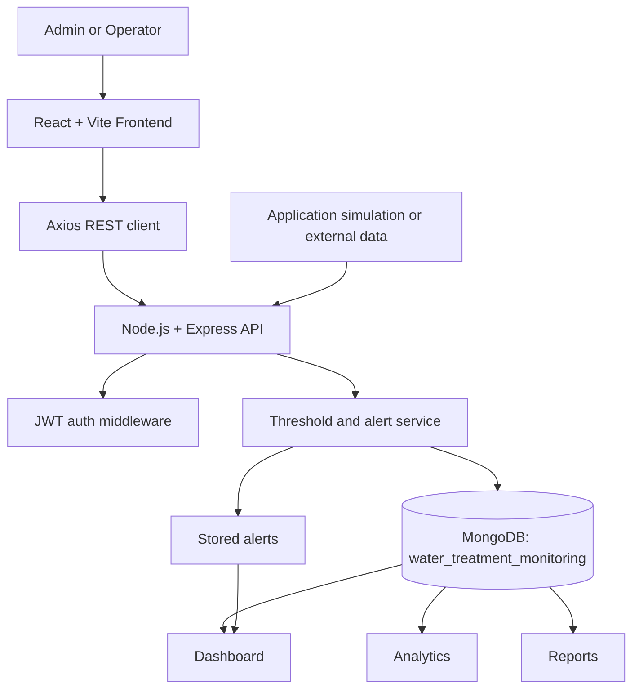

# System Architecture

```mermaid
flowchart TD
  U[Admin or Operator] --> R[React + Vite Frontend]
  R --> A[Axios REST client]
  A --> E[Node.js + Express API]
  E --> M[JWT auth middleware]
  E --> S[Threshold and alert service]
  S --> DB[(MongoDB: water_treatment_monitoring)]
  SIM[Application simulation or external data] --> E
  DB --> D[Dashboard]
  DB --> AN[Analytics]
  DB --> RP[Reports]
  S --> AL[Stored alerts]
  AL --> D
```

The current system receives monitoring data through simulated or externally provided sources. It does not claim physical sensor installation or direct plant control.
