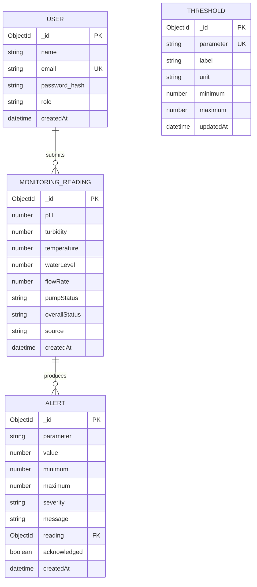

# Entity Relationship Diagram

`MonitoringReading` is currently created by an authenticated request rather than storing a user foreign key, because both the simulator and externally provided sources use the same ingestion endpoint. `Alert.reading` references its originating reading. `Threshold` is keyed by parameter and is consumed by the threshold service.
