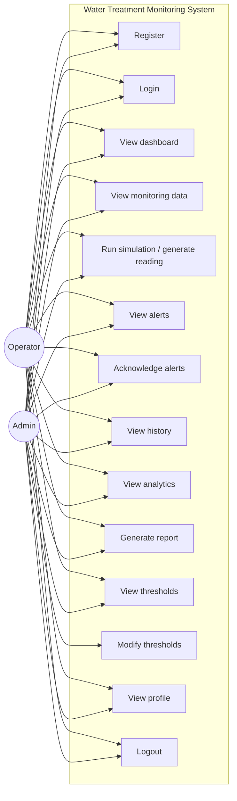

# Use Case Diagram

```mermaid
flowchart LR
  Admin((Admin))
  Operator((Operator))
  subgraph System[Water Treatment Monitoring System]
    Register[Register]
    Login[Login]
    Dashboard[View dashboard]
    Monitor[View monitoring data]
    Sim[Run simulation / generate reading]
    Alerts[View alerts]
    Ack[Acknowledge alerts]
    History[View history]
    Analytics[View analytics]
    Reports[Generate report]
    ViewT[View thresholds]
    EditT[Modify thresholds]
    Profile[View profile]
    Logout[Logout]
  end
  Admin --> Register
  Operator --> Register
  Admin --> Login
  Operator --> Login
  Admin --> Dashboard
  Operator --> Dashboard
  Admin --> Monitor
  Operator --> Monitor
  Admin --> Sim
  Operator --> Sim
  Admin --> Alerts
  Operator --> Alerts
  Admin --> Ack
  Operator --> Ack
  Admin --> History
  Operator --> History
  Admin --> Analytics
  Operator --> Analytics
  Admin --> Reports
  Operator --> Reports
  Admin --> ViewT
  Operator --> ViewT
  Admin --> EditT
  Admin --> Profile
  Operator --> Profile
  Admin --> Logout
  Operator --> Logout
```
